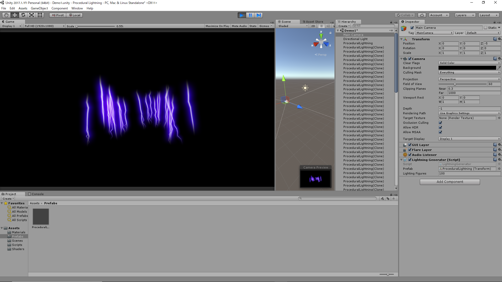

# Unity3D | Procedural Lightning Shader Demo

The original shader code is converted to use in Unity(ShaderLab) from "Lightining" by asti on Shadertoy(https://www.shadertoy.com/view/Xds3Rj)

Some screenshot below.

